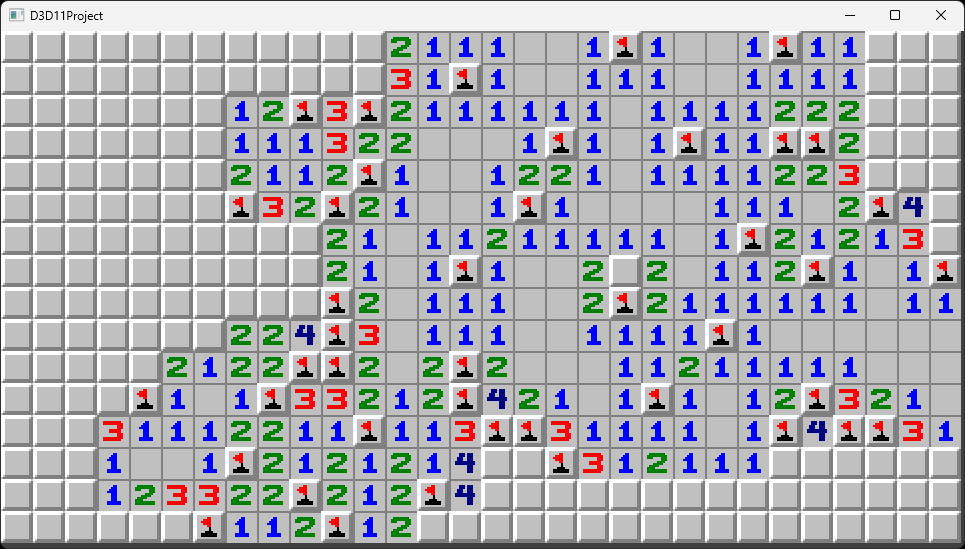

# minesweeper
A crude implementation of my favorite game.

This project uses a handmade D3D11 renderer.



## Features:
- [x] Chording
- [x] Flood fill
- [ ] Win condition

## Building:

You need the Windows SDK.
```
cl main.cpp
```
Or alternatively run the provided `build.bat` file with the msvc environment variables set, if you want.
